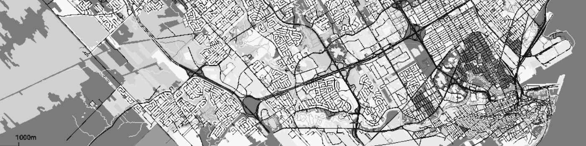

## Hi there, I'm Adrien

❯ I'm currently a 2nd year student in the M.Sc. Data Science & Business Analytics at HEC Montréal

❯ VP Education @ CSD - Data Science for Business HEC Montréal

❯ Research Assistant in Data Science at HEC Montréal

I love to code, nerd out on data and solve complex problems with AI ⚡.

**I'm looking for a data scientist position in Montréal starting April 2021.**

### My languages :

### My tools :

### My softwares :

